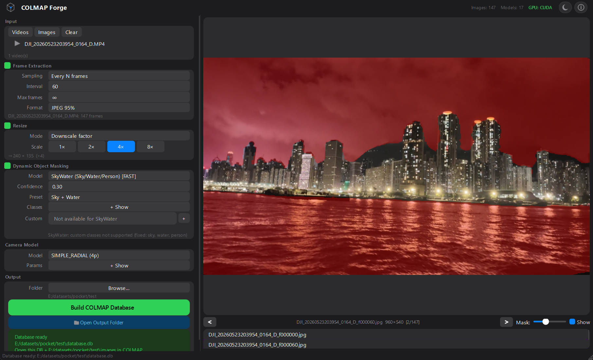

# COLMAP Forge

<p align="center">
  
</p>

A PyQt6 desktop wizard that prepares video and image data for [COLMAP](https://github.com/colmap/colmap) Structure-from-Motion frame extraction, resizing, SAM-based dynamic object masking, and `database.db` export.

## Quick Start

```bash
git clone https://github.com/Vincentqyw/colmapforge.git
cd colmapforge

uv sync                       # install everything (CPU, works everywhere)
uv run colmapforge            # launch the GUI
```

> **macOS users** — CoreML (Apple Silicon GPU / Neural Engine) is included in the
> default CPU wheel — no extra setup needed. **Linux / Windows users with NVIDIA
> GPUs** — add `uv pip install onnxruntime-gpu` after `uv sync` for CUDA
> acceleration.

> **Zero-config models** — 16 SAM variants + SkyWater download from
> HuggingFace on first use and cache to `~/.colmapforge/models/`.

## Workflow

1. **Input** — Add video files and/or image folders
2. **Frame Extraction** — Sample frames by interval, FPS, or time range
3. **Resize** — Downscale with max-dimension or fixed-factor modes
4. **Segmentation** — SAM (text-prompt or grid-prompt) or SkyWater (fast sky/water/people)
5. **Camera** — Choose from 18 COLMAP camera models (SIMPLE_RADIAL default)
6. **Build** — One-click `database.db` + masked images export

## Features

- **4-stage pipeline** — extraction → resize → masking → database, chained async via `QThreadPool`
- **Zero-config models** — 16 SAM/SAM2/SAM3 + SkyWater auto-download on first run
- **SAM1 / SAM2 / SAM3** — auto-detected from ONNX graph inputs; SAM3 supports text prompts
- **SkyWater** — SegFormer-B2 for fast sky/water/person segmentation (~48 MB)
- **18 camera models** — SIMPLE_PINHOLE through EQUIRECTANGULAR, with prior focal length
- **GPU auto-detect** — CUDA → CoreML → CPU fallback; toolbar indicator shows active backend
- **Dark / Light themes** — Apple HIG-inspired `QPalette` + QSS, toggle with Ctrl+T
- **Preview panel** — real-time mask overlay with opacity control

## Available Models

All models are ONNX-based and download on first use. The SAM variant (1/2/3)
is auto-detected from the ONNX graph — you don't need to pick.

<details>
<summary><b>SAM1</b> (7 models)</summary>

| Model | Size |
|-------|------|
| MobileSAM | ~45 MB |
| ViT-B | ~380 MB |
| ViT-B (Quant) | ~190 MB |
| ViT-L | ~1.2 GB |
| ViT-L (Quant) | ~340 MB |
| ViT-H | ~2.5 GB |
| ViT-H (Quant) | ~670 MB |

</details>

<details>
<summary><b>SAM2</b> (4 models)</summary>

| Model | Size |
|-------|------|
| Hiera-Tiny | ~160 MB |
| Hiera-Small | ~185 MB |
| Hiera-Base+ | ~325 MB |
| Hiera-Large | ~900 MB |

</details>

<details>
<summary><b>SAM 2.1</b> (4 models)</summary>

| Model | Size |
|-------|------|
| Hiera-Tiny | ~160 MB |
| Hiera-Small | ~185 MB |
| Hiera-Base+ | ~325 MB |
| Hiera-Large | ~900 MB |

</details>

<details>
<summary><b>SAM3</b> (1 model)</summary>

| Model | Size |
|-------|------|
| SAM3 ViT-H | ~3.0 GB |

</details>

<details>
<summary><b>SkyWater</b> (1 model — <a href="https://github.com/Vincentqyw/skywater_seg">SegFormer</a>)</summary>

| Model | Size |
|-------|------|
| [SkyWater](https://github.com/Vincentqyw/skywater_seg) SegFormer-B2 | ~48 MB |

</details>

## ONNX Runtime Backend

<details>
<summary>GPU setup details — click to expand</summary>

The default `uv sync` installs CPU `onnxruntime` which works everywhere.
**macOS** users get CoreML (Apple Silicon GPU / Neural Engine) automatically
— no extra setup needed.

For **NVIDIA GPU** acceleration (Linux / Windows):

```bash
uv pip install onnxruntime-gpu
```

Two wheels exist — **install only one** (they share the same module and
silently overwrite each other's binaries):

| Package | Platform | Acceleration |
|---------|----------|-------------|
| `onnxruntime` (default) | macOS / Linux / Windows | CoreML on macOS, CPU elsewhere |
| `onnxruntime-gpu` | Linux / Windows (NVIDIA) | CUDA |

The app auto-detects the best provider: **CUDA → CoreML → CPU**.
A toolbar indicator shows the active backend (green = GPU, orange = CPU).

**Switching backends:**

```bash
uv pip install onnxruntime --force-reinstall        # → CPU / CoreML
uv pip install onnxruntime-gpu --force-reinstall    # → CUDA
```

**Force-clean stale files:**

```bash
uv pip uninstall onnxruntime onnxruntime-gpu
rm -rf .venv/lib/python*/site-packages/onnxruntime/
uv sync
```

**NVIDIA CUDA requirements:**

- Driver ≥ 580 (CUDA 13)
- CUDA 13.x Toolkit on PATH
- cuDNN 9 + cuBLAS 13 bundled in `onnxruntime-gpu`

</details>

## Keyboard Shortcuts

| Shortcut | Action |
|----------|--------|
| `Ctrl + O` | Add images |
| `Ctrl + B` | Build COLMAP database |
| `Ctrl + T` | Toggle dark/light theme |

## Requirements

- Python ≥ 3.11
- PyQt6 ≥ 6.6
- OpenCV ≥ 4.8
- ONNX Runtime ≥ 1.28 (see [above](#onnx-runtime-backend))
- `huggingface_hub` ≥ 0.24 (for SkyWater download)

## License

MIT — see [LICENSE](LICENSE) for details.
