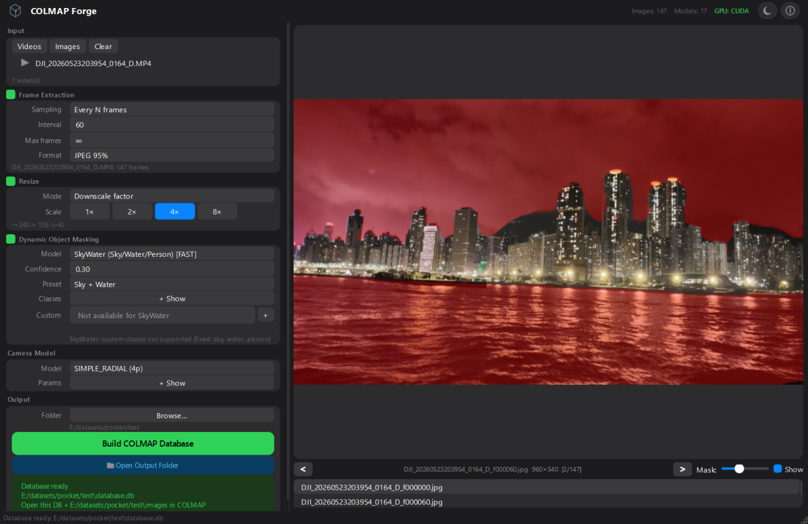

# COLMAP Forge

<p align="center">
  
</p>

A PyQt6 desktop wizard that prepares video and image data for [COLMAP](https://github.com/colmap/colmap) Structure-from-Motion frame extraction, resizing, SAM-based dynamic object masking, and `database.db` export.

## Quick Start

```bash
git clone https://github.com/Vincentqyw/colmapforge.git
cd colmapforge

# Install with your GPU backend (pick ONE)
uv sync --extra gpu          # NVIDIA + CUDA 13
uv sync --extra directml     # Windows, any GPU
uv sync --extra cpu          # CPU fallback

uv run colmapforge
```

> **Zero-config models** — 16 SAM variants + SkyWater download from
> HuggingFace on first use and cache to `~/.colmapforge/models/`.

## Workflow

1. **Input** — Add video files and/or image folders
2. **Frame Extraction** — Sample frames by interval, FPS, or time range
3. **Resize** — Downscale with max-dimension or fixed-factor modes
4. **Segmentation** — SAM (text-prompt or grid-prompt) or SkyWater (fast sky/water/people)
5. **Camera** — Choose from 18 COLMAP camera models (SIMPLE_RADIAL default)
6. **Build** — One-click `database.db` + masked images export

## Features

- **4-stage pipeline** — extraction → resize → masking → database, chained async via `QThreadPool`
- **Zero-config models** — 16 SAM/SAM2/SAM3 + SkyWater auto-download on first run
- **SAM1 / SAM2 / SAM3** — auto-detected from ONNX graph inputs; SAM3 supports text prompts
- **SkyWater** — SegFormer-B2 for fast sky/water/person segmentation (~48 MB)
- **18 camera models** — SIMPLE_PINHOLE through EQUIRECTANGULAR, with prior focal length
- **GPU auto-detect** — CUDA → DirectML → CPU fallback; toolbar indicator shows active backend
- **Dark / Light themes** — Apple HIG-inspired `QPalette` + QSS, toggle with Ctrl+T
- **Preview panel** — real-time mask overlay with opacity control

## Available Models

All models are ONNX-based and download on first use. The SAM variant (1/2/3)
is auto-detected from the ONNX graph — you don't need to pick.

<details>
<summary><b>SAM1</b> (7 models)</summary>

| Model | Size |
|-------|------|
| MobileSAM | ~45 MB |
| ViT-B | ~380 MB |
| ViT-B (Quant) | ~190 MB |
| ViT-L | ~1.2 GB |
| ViT-L (Quant) | ~340 MB |
| ViT-H | ~2.5 GB |
| ViT-H (Quant) | ~670 MB |

</details>

<details>
<summary><b>SAM2</b> (4 models)</summary>

| Model | Size |
|-------|------|
| Hiera-Tiny | ~160 MB |
| Hiera-Small | ~185 MB |
| Hiera-Base+ | ~325 MB |
| Hiera-Large | ~900 MB |

</details>

<details>
<summary><b>SAM 2.1</b> (4 models)</summary>

| Model | Size |
|-------|------|
| Hiera-Tiny | ~160 MB |
| Hiera-Small | ~185 MB |
| Hiera-Base+ | ~325 MB |
| Hiera-Large | ~900 MB |

</details>

<details>
<summary><b>SAM3</b> (1 model) + <b>SkyWater</b> (1 model)</summary>

| Model | Size |
|-------|------|
| SAM3 ViT-H | ~3.0 GB |
| SkyWater SegFormer-B2 | ~48 MB |

</details>

## ONNX Runtime Backend

<details>
<summary>GPU setup details — click to expand</summary>

Three mutually-exclusive ONNX Runtime wheels exist — **install only one**:

| Extra | Package | When |
|-------|---------|------|
| `[gpu]` | `onnxruntime-gpu` | NVIDIA + CUDA 13 Toolkit |
| `[directml]` | `onnxruntime-directml` | Windows, any GPU |
| `[cpu]` | `onnxruntime` | No GPU or unsupported |

> **⚠️** Installing multiple wheels silently breaks GPU acceleration —
> their shared `site-packages/onnxruntime/` files overwrite each other.

The toolbar shows a live GPU status indicator: green = CUDA/DirectML,
orange = CPU, red = broken. Click it for full diagnostics.

**Switching backends:**

```bash
uv sync --extra directml   # GPU → DirectML
uv sync --extra cpu        # → CPU
uv sync --extra gpu        # → CUDA
```

**Force-clean stale files:**

```powershell
uv pip uninstall onnxruntime onnxruntime-gpu onnxruntime-directml
Remove-Item .venv/Lib/site-packages/onnxruntime -Recurse -Force
uv sync --extra gpu
```

**NVIDIA CUDA (for `[gpu]`):**

- Driver ≥ 580 (CUDA 13)
- CUDA 13.x Toolkit on PATH (`cudart64_13.dll`)
- cuDNN 9 + cuBLAS 13 bundled in `onnxruntime-gpu`

</details>

## Keyboard Shortcuts

| Shortcut | Action |
|----------|--------|
| `Ctrl + O` | Add images |
| `Ctrl + B` | Build COLMAP database |
| `Ctrl + T` | Toggle dark/light theme |

## Requirements

- Python ≥ 3.11
- PyQt6 ≥ 6.6
- OpenCV ≥ 4.8
- ONNX Runtime (see [above](#onnx-runtime-backend))
- `huggingface_hub` ≥ 0.24 (for SkyWater download)

## License

MIT — see [LICENSE](LICENSE) for details.
